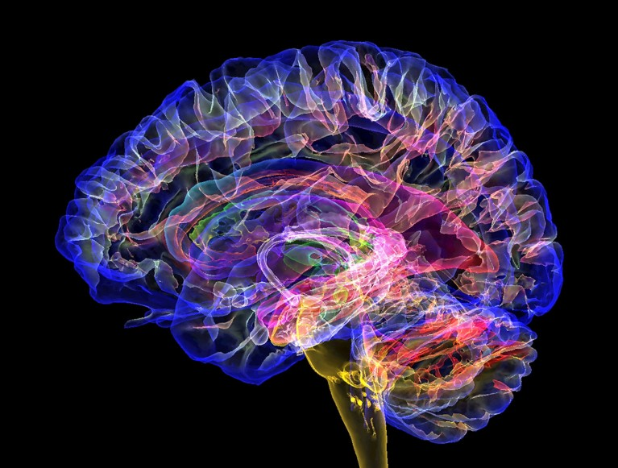
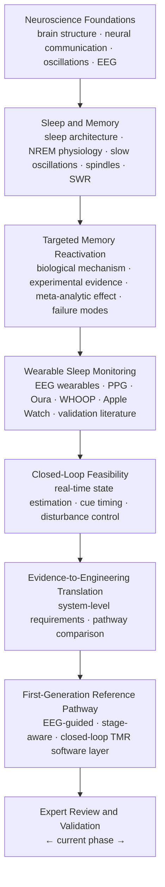

# Neuro-TMR Research

  

> **Can the neuroscience of sleep-dependent memory consolidation be translated into a scientifically defensible closed-loop neurotechnology pathway — without converting unresolved assumptions into engineering claims?**

Sleep is not passive. During non-rapid eye movement sleep, the brain coordinates slow oscillations, sleep spindles, and hippocampal sharp-wave ripples to consolidate and reorganize recently encoded memories. Targeted Memory Reactivation (TMR) research demonstrates that sensory cues associated with prior learning, when re-presented under appropriate sleep conditions, can measurably bias this consolidation process. But a laboratory effect is not automatically a technology.

This repository documents the structured research journey from neuroscience foundations toward a scientifically grounded first-generation neurotechnology pathway — following a single guiding principle throughout:

**Evidence before engineering.**

---

**Status:** Research synthesis & manuscript complete → External expert review & collaboration phase

📄 **Manuscript:** [From Neuroscience to Neurotechnology: Evidence-Based Translation of Targeted Memory Reactivation into a First-Generation Closed-Loop Reference Pathway](05_manuscript/final/Neuro_TMR_Expert_Review_Manuscript_v1/Neuro_TMR_Paper.pdf)
Vahe Gdlyan · Independent Researcher (Yerevan, Armenia) · Frozen August 2026 · v1

---

## Medium Articles

Accessible write-ups that explain the core ideas behind the research — written for curious readers who want the science without the LaTeX.

---

## Why This Project Exists

The sleeping brain participates actively in memory consolidation. TMR research — including a meta-analysis of 91 experiments yielding an average effect size of Hedges' *g* = 0.29 — shows that cue-triggered reactivation during NREM sleep can produce a modest, condition-dependent improvement in subsequent memory. The effect is real but not universal: it depends on many things including type of memory, encoding quality, cueing protocol, sleep stage, and physiological context.

The problem is that **experimental efficacy does not equal a working intervention system.**

A laboratory TMR setup assumes physiological recording, controlled and carefully timed cue delivery, continuous human oversight, and the ability to suspend stimulation when sleep becomes unstable. Reproducing this outside the lab requires solving a chain of connected problems:

- Estimating the current sleep state continuously and causally, in real time
- Withholding stimulation when the physiological conditions are not met
- Delivering cues with bounded, measurable latency relative to the state that authorized them
- Detecting and responding to post-stimulation arousal or state disruption
- Avoiding the use of retrospective sleep-staging accuracy as a proxy for intervention readiness

This repository exists to investigate that translational gap systematically — not to assume it away.

---

## Research Journey

The research was organized as 23 sequential research questions, moving from cellular neuroscience through sleep physiology, TMR experimental evidence, wearable sensing, and translational architecture. Daily logs document the progression from July 3 to August 10, 2026.

---

## The Central Research Question

> *How can current evidence on sleep-dependent memory consolidation, Targeted Memory Reactivation, and wearable sleep monitoring be translated into a scientifically defensible first-generation pathway for real-time closed-loop TMR?*

The analysis distinguished four translational levels that are related but not interchangeable:

| Level | Meaning |
|---|---|
| **Biological plausibility** | Is the intervention consistent with established mechanisms? |
| **Experimental efficacy** | Does it produce measurable effects under controlled conditions? |
| **Technical feasibility** | Can available sensing and computation reproduce the required functions? |
| **Product readiness** | Has an integrated system demonstrated sufficient reliability for deployment? |

Conclusions in this work are restricted to the level directly supported by reviewed evidence.

---

## What the Research Found

The manuscript integrates evidence from six domains — memory formation and consolidation, sleep-dependent neural reactivation, TMR experiments, wearable sleep monitoring, real-time state estimation, and closed-loop physiological intervention — and arrives at a qualified but actionable conclusion.

**The first-generation reference pathway is:** an EEG-guided, stage-aware, real-time closed-loop TMR software layer, intended for integration with compatible existing EEG hardware.

This selection is not a claim of EEG's permanent superiority over peripheral sensing. Peripheral approaches (PPG-based devices such as Oura Ring and WHOOP) have already demonstrated proof-of-concept feasibility for home-based automated TMR. EEG is selected *first* because it currently preserves closer continuity with the electrophysiological signals and experimental conditions used to characterize sleep and TMR, while avoiding the additional inference steps required by peripheral-only sensing.

**What this pathway is not:**
- A validated product
- A claim of guaranteed memory enhancement
- A demonstration that the integrated closed-loop system works prospectively
- An argument that PPG-based sensing is permanently excluded

The pathway is a **testable reference configuration** — a scientifically bounded route from evidence to experiment, defining what should be investigated first and what evidence must exist before the next claim is justified.

---

## Repository Structure

| Folder | Contents |
|---|---|
| `01_literature_review/` | Reference list, foundational texts, 21 source PDFs (EEG wearables, PPG devices, closed-loop TMR) |
| `02_daily_logs/` | Day-by-day research logs, July 3 – August 11, 2026 |
| `03_research_questions/` | 23 RQs spanning neuroscience foundations, sleep, TMR, and translational architecture |
| `04_experts_and_labs/` | Expert contact tracking (Phase II) |
| `05_manuscript/final/` | Complete LaTeX source, PDF, figures, and bibliography |

The full manuscript PDF is the primary output of Phase I: [`Neuro_TMR_Paper.pdf`](05_manuscript/final/Neuro_TMR_Expert_Review_Manuscript_v1/Neuro_TMR_Paper.pdf)

---

## Current Status and What Comes Next

**Phase I — Research and manuscript preparation: complete.**

The manuscript (~49 pages) was frozen on August 10, 2026 as *Expert Review Manuscript v1*. Future revisions will be driven by external scientific feedback, newly relevant evidence, or formal publication requirements.

**Phase II — External expert review and collaboration: active.**

The project is now seeking:

- Scientific review and critique of the translational methodology and conclusions
- Collaboration with researchers in sleep neuroscience, TMR, wearable EEG, closed-loop stimulation, or real-time signal processing
- Empirical guidance on what prospective validation should look like before any engineering commitments are made

The integrated closed-loop system described in the manuscript has **not** been prospectively validated. Engineering and product decisions are intentionally deferred until external scientific review informs whether, and in what direction, empirical work should proceed.

---

## Contact and Collaboration

**Author:** Vahe Gdlyan · Independent Researcher · Yerevan, Armenia

If you work in sleep neuroscience, TMR, wearable EEG, closed-loop systems, or related areas and are open to discussing this work — scientific critique, methodological feedback, or potential collaboration — I would be glad to hear from you.

---

## License

[MIT License](LICENSE)

---

*This repository represents an independent research effort. No institutional affiliation, funding body, or collaborator is implied. All factual claims in the manuscript are grounded in cited published literature.*
